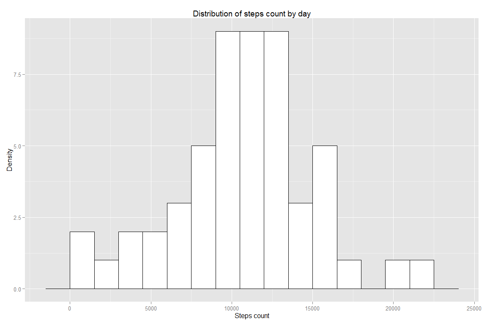
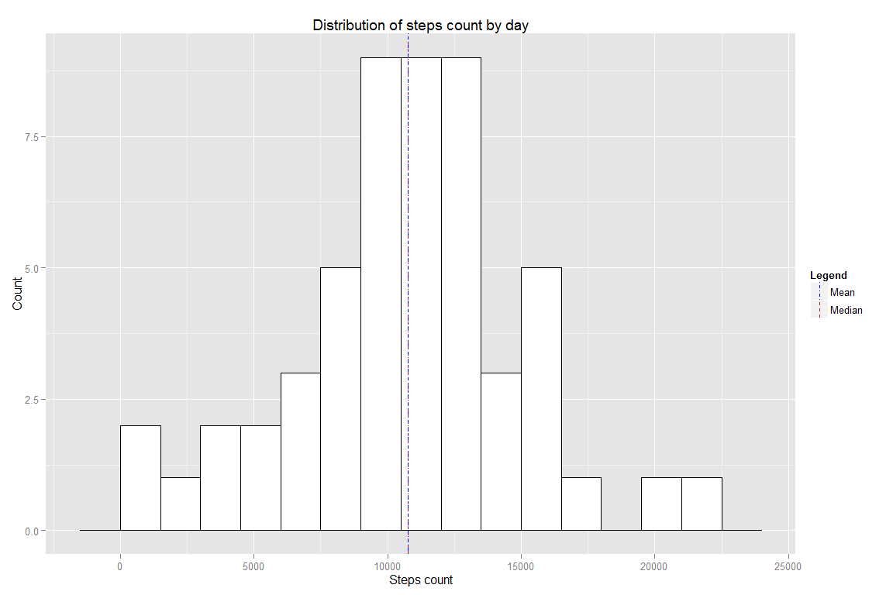
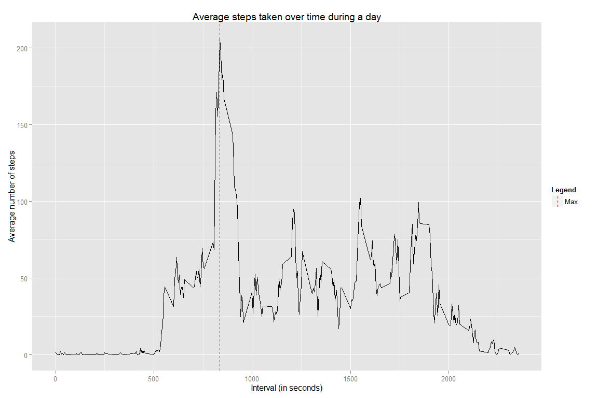
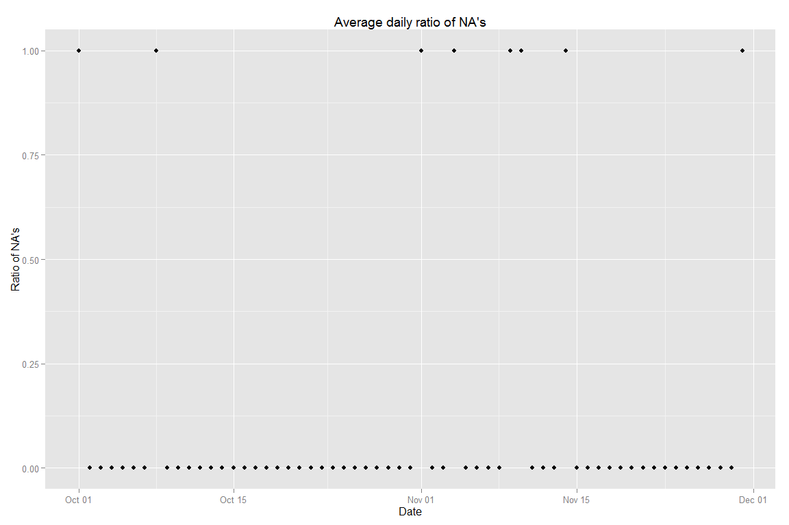
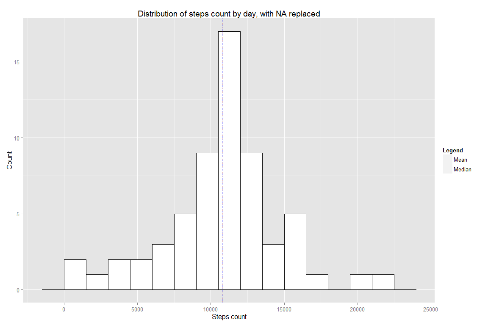
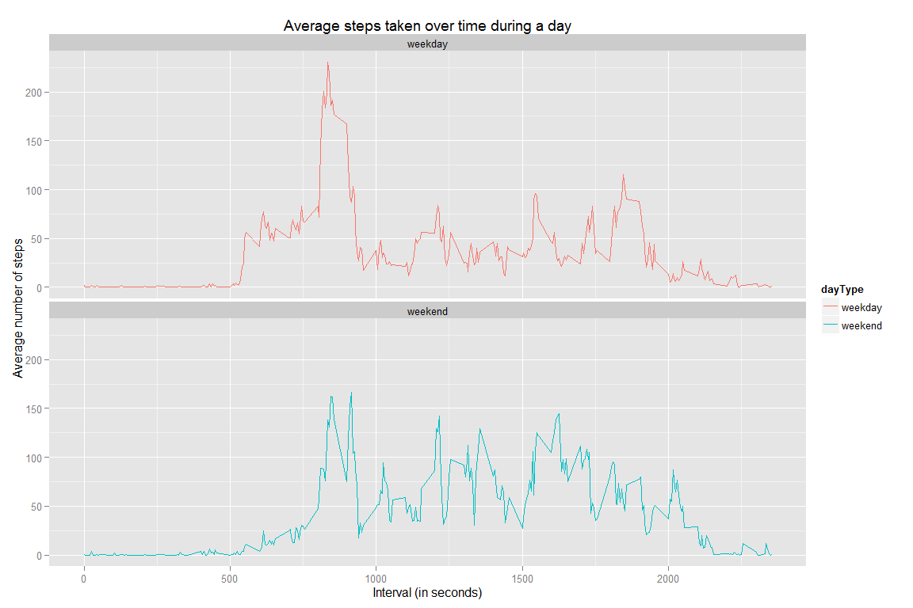

# Reproducible Research: Peer Assessment 1
 

We declare the libraries we will use for the data analysis:


```r
# dplyr is used for data manipulation
library(dplyr)
library(tidyr) # used for spread
# ggplot2 will be used for the plts
library(ggplot2)
# xtable is used to output table into the documentation and get cleaner results
library(xtable)
# scales is used to format the axis labels on the graphs
library(scales) 

# We turn off locale specific translation (for weekdays part)
Sys.setlocale( category = "LC_ALL", locale =  "C") 
```


## Initialization

Make sure we always work the same way.


```r
set.seed(1)
```


## Loading and preprocessing the data

To looad the data, we start by looking if the data file is already available or need to be unzipped. 

Then we load the raw csv file. Finally, in order to get easy-to parse and display data, we add a shortDate factor variable, which is a string representation of the date. We make sure the factor levels are correctly ordered.


```r
if (!file.exists("activity.csv")) {
    unzip("activity.zip", exdir=".")
}

# Process the data directly during the import 
# by correctly using the date format
activity <- read.csv("activity.csv", 
                 header = TRUE, 
                 colClasses = c("integer", "POSIXct", "integer"))

# Add a human-readable date column to get a clean output 
activity <- activity %>% mutate(shortDate = format(date))
activity$shortDate  <- factor(activity$shortDate,
                                 sort(unique(activity$shortDate)))
```


## What is mean total number of steps taken per day?


We are going to start by computing:

- the total number of steps taken each day, 
- the median number of steps taken each day,
- the mean of number of steps taken each day.

We will ignore NAs in this computations, using `na.omit` to remove these observations.


```r
steps.total.dat <-  na.omit(activity) %>% 
                group_by(shortDate) %>% 
                summarise(steps.mean = mean(steps, na.rm = TRUE), 
                          steps.median = median(steps, na.rm = TRUE),
                          steps.tally = sum(steps, na.rm = TRUE))

# Cleanup the date to avoid displaying the POSIXct raw value
print(xtable(steps.total.dat), type="html", include.rownames=FALSE, floating=FALSE)
```

<!-- html table generated in R 3.1.2 by xtable 1.7-4 package -->
<!-- Sat Mar 14 20:10:45 2015 -->
<table border=1>
<tr> <th> shortDate </th> <th> steps.mean </th> <th> steps.median </th> <th> steps.tally </th>  </tr>
  <tr> <td> 2012-10-02 </td> <td align="right"> 0.44 </td> <td align="right"> 0.00 </td> <td align="right"> 126 </td> </tr>
  <tr> <td> 2012-10-03 </td> <td align="right"> 39.42 </td> <td align="right"> 0.00 </td> <td align="right"> 11352 </td> </tr>
  <tr> <td> 2012-10-04 </td> <td align="right"> 42.07 </td> <td align="right"> 0.00 </td> <td align="right"> 12116 </td> </tr>
  <tr> <td> 2012-10-05 </td> <td align="right"> 46.16 </td> <td align="right"> 0.00 </td> <td align="right"> 13294 </td> </tr>
  <tr> <td> 2012-10-06 </td> <td align="right"> 53.54 </td> <td align="right"> 0.00 </td> <td align="right"> 15420 </td> </tr>
  <tr> <td> 2012-10-07 </td> <td align="right"> 38.25 </td> <td align="right"> 0.00 </td> <td align="right"> 11015 </td> </tr>
  <tr> <td> 2012-10-09 </td> <td align="right"> 44.48 </td> <td align="right"> 0.00 </td> <td align="right"> 12811 </td> </tr>
  <tr> <td> 2012-10-10 </td> <td align="right"> 34.38 </td> <td align="right"> 0.00 </td> <td align="right"> 9900 </td> </tr>
  <tr> <td> 2012-10-11 </td> <td align="right"> 35.78 </td> <td align="right"> 0.00 </td> <td align="right"> 10304 </td> </tr>
  <tr> <td> 2012-10-12 </td> <td align="right"> 60.35 </td> <td align="right"> 0.00 </td> <td align="right"> 17382 </td> </tr>
  <tr> <td> 2012-10-13 </td> <td align="right"> 43.15 </td> <td align="right"> 0.00 </td> <td align="right"> 12426 </td> </tr>
  <tr> <td> 2012-10-14 </td> <td align="right"> 52.42 </td> <td align="right"> 0.00 </td> <td align="right"> 15098 </td> </tr>
  <tr> <td> 2012-10-15 </td> <td align="right"> 35.20 </td> <td align="right"> 0.00 </td> <td align="right"> 10139 </td> </tr>
  <tr> <td> 2012-10-16 </td> <td align="right"> 52.38 </td> <td align="right"> 0.00 </td> <td align="right"> 15084 </td> </tr>
  <tr> <td> 2012-10-17 </td> <td align="right"> 46.71 </td> <td align="right"> 0.00 </td> <td align="right"> 13452 </td> </tr>
  <tr> <td> 2012-10-18 </td> <td align="right"> 34.92 </td> <td align="right"> 0.00 </td> <td align="right"> 10056 </td> </tr>
  <tr> <td> 2012-10-19 </td> <td align="right"> 41.07 </td> <td align="right"> 0.00 </td> <td align="right"> 11829 </td> </tr>
  <tr> <td> 2012-10-20 </td> <td align="right"> 36.09 </td> <td align="right"> 0.00 </td> <td align="right"> 10395 </td> </tr>
  <tr> <td> 2012-10-21 </td> <td align="right"> 30.63 </td> <td align="right"> 0.00 </td> <td align="right"> 8821 </td> </tr>
  <tr> <td> 2012-10-22 </td> <td align="right"> 46.74 </td> <td align="right"> 0.00 </td> <td align="right"> 13460 </td> </tr>
  <tr> <td> 2012-10-23 </td> <td align="right"> 30.97 </td> <td align="right"> 0.00 </td> <td align="right"> 8918 </td> </tr>
  <tr> <td> 2012-10-24 </td> <td align="right"> 29.01 </td> <td align="right"> 0.00 </td> <td align="right"> 8355 </td> </tr>
  <tr> <td> 2012-10-25 </td> <td align="right"> 8.65 </td> <td align="right"> 0.00 </td> <td align="right"> 2492 </td> </tr>
  <tr> <td> 2012-10-26 </td> <td align="right"> 23.53 </td> <td align="right"> 0.00 </td> <td align="right"> 6778 </td> </tr>
  <tr> <td> 2012-10-27 </td> <td align="right"> 35.14 </td> <td align="right"> 0.00 </td> <td align="right"> 10119 </td> </tr>
  <tr> <td> 2012-10-28 </td> <td align="right"> 39.78 </td> <td align="right"> 0.00 </td> <td align="right"> 11458 </td> </tr>
  <tr> <td> 2012-10-29 </td> <td align="right"> 17.42 </td> <td align="right"> 0.00 </td> <td align="right"> 5018 </td> </tr>
  <tr> <td> 2012-10-30 </td> <td align="right"> 34.09 </td> <td align="right"> 0.00 </td> <td align="right"> 9819 </td> </tr>
  <tr> <td> 2012-10-31 </td> <td align="right"> 53.52 </td> <td align="right"> 0.00 </td> <td align="right"> 15414 </td> </tr>
  <tr> <td> 2012-11-02 </td> <td align="right"> 36.81 </td> <td align="right"> 0.00 </td> <td align="right"> 10600 </td> </tr>
  <tr> <td> 2012-11-03 </td> <td align="right"> 36.70 </td> <td align="right"> 0.00 </td> <td align="right"> 10571 </td> </tr>
  <tr> <td> 2012-11-05 </td> <td align="right"> 36.25 </td> <td align="right"> 0.00 </td> <td align="right"> 10439 </td> </tr>
  <tr> <td> 2012-11-06 </td> <td align="right"> 28.94 </td> <td align="right"> 0.00 </td> <td align="right"> 8334 </td> </tr>
  <tr> <td> 2012-11-07 </td> <td align="right"> 44.73 </td> <td align="right"> 0.00 </td> <td align="right"> 12883 </td> </tr>
  <tr> <td> 2012-11-08 </td> <td align="right"> 11.18 </td> <td align="right"> 0.00 </td> <td align="right"> 3219 </td> </tr>
  <tr> <td> 2012-11-11 </td> <td align="right"> 43.78 </td> <td align="right"> 0.00 </td> <td align="right"> 12608 </td> </tr>
  <tr> <td> 2012-11-12 </td> <td align="right"> 37.38 </td> <td align="right"> 0.00 </td> <td align="right"> 10765 </td> </tr>
  <tr> <td> 2012-11-13 </td> <td align="right"> 25.47 </td> <td align="right"> 0.00 </td> <td align="right"> 7336 </td> </tr>
  <tr> <td> 2012-11-15 </td> <td align="right"> 0.14 </td> <td align="right"> 0.00 </td> <td align="right">  41 </td> </tr>
  <tr> <td> 2012-11-16 </td> <td align="right"> 18.89 </td> <td align="right"> 0.00 </td> <td align="right"> 5441 </td> </tr>
  <tr> <td> 2012-11-17 </td> <td align="right"> 49.79 </td> <td align="right"> 0.00 </td> <td align="right"> 14339 </td> </tr>
  <tr> <td> 2012-11-18 </td> <td align="right"> 52.47 </td> <td align="right"> 0.00 </td> <td align="right"> 15110 </td> </tr>
  <tr> <td> 2012-11-19 </td> <td align="right"> 30.70 </td> <td align="right"> 0.00 </td> <td align="right"> 8841 </td> </tr>
  <tr> <td> 2012-11-20 </td> <td align="right"> 15.53 </td> <td align="right"> 0.00 </td> <td align="right"> 4472 </td> </tr>
  <tr> <td> 2012-11-21 </td> <td align="right"> 44.40 </td> <td align="right"> 0.00 </td> <td align="right"> 12787 </td> </tr>
  <tr> <td> 2012-11-22 </td> <td align="right"> 70.93 </td> <td align="right"> 0.00 </td> <td align="right"> 20427 </td> </tr>
  <tr> <td> 2012-11-23 </td> <td align="right"> 73.59 </td> <td align="right"> 0.00 </td> <td align="right"> 21194 </td> </tr>
  <tr> <td> 2012-11-24 </td> <td align="right"> 50.27 </td> <td align="right"> 0.00 </td> <td align="right"> 14478 </td> </tr>
  <tr> <td> 2012-11-25 </td> <td align="right"> 41.09 </td> <td align="right"> 0.00 </td> <td align="right"> 11834 </td> </tr>
  <tr> <td> 2012-11-26 </td> <td align="right"> 38.76 </td> <td align="right"> 0.00 </td> <td align="right"> 11162 </td> </tr>
  <tr> <td> 2012-11-27 </td> <td align="right"> 47.38 </td> <td align="right"> 0.00 </td> <td align="right"> 13646 </td> </tr>
  <tr> <td> 2012-11-28 </td> <td align="right"> 35.36 </td> <td align="right"> 0.00 </td> <td align="right"> 10183 </td> </tr>
  <tr> <td> 2012-11-29 </td> <td align="right"> 24.47 </td> <td align="right"> 0.00 </td> <td align="right"> 7047 </td> </tr>
   </table>


There's a lot of data. To be able to get an idea oof what's going on, we will lot at the distribution of these means.


```r
ggplot(steps.total.dat, aes(x = steps.tally)) + 
    geom_histogram(binwidth = 1500,
                   colour = "black", fill="white") +
    labs(title = "Distribution of steps count by day", x = "Steps count", y = "Density") +
    scale_y_continuous(labels = comma)
```

 


What are the mean and median of the total number of steps taken per day?


```r
total.steps.mean <- mean(steps.total.dat$steps.tally, na.rm = TRUE)
total.steps.median <- median(steps.total.dat$steps.tally, na.rm = TRUE)


# Plot the same histogram, with additional layers for the mean and medians

ggplot(steps.total.dat, aes(x=steps.tally)) + 
    geom_histogram(binwidth=1500,
                   colour="black", fill="white") +
    scale_y_continuous(labels=comma) +
    geom_vline(aes(xintercept=total.steps.median, color="Median", linetype="Median"), show_guide=TRUE) +
    geom_vline(aes(xintercept=total.steps.mean, color="Mean", linetype="Mean"), show_guide=TRUE) +
    scale_colour_manual(name="Legend", values=c(Median="firebrick", Mean="blue")) +
    scale_linetype_manual(name="Legend", values=c(Median="dashed", Mean="dotdash")) +
    labs(title="Distribution of steps count by day", x="Steps count", y="Count")
```

 

```r
# Output the computed values in the report
cat("Mean:", total.steps.mean)
```

```
## Mean: 10766.19
```

```r
cat("Median:", total.steps.median)
```

```
## Median: 10765
```

We can see that the mean and the median are almost equal.


## What is the average daily activity pattern?

In order to get the daily pattern, we will average the steps taken each 5 minute interval accross all days.

We will mark the moment of the day which contains the most steps, avergard across all the days.


```r
steps.averages <- activity %>% 
                group_by(interval) %>% 
                summarise(steps.mean = mean(steps, na.rm = TRUE), 
                          steps.median = median(steps, na.rm = TRUE),
                          steps.tally = sum(steps, na.rm = TRUE))

max.ind <- which.max(steps.averages$steps.mean)
max.values <- steps.averages[max.ind,]
```

With these values, we can have an overview of a typical day.


```r
ggplot(data=steps.averages, aes(x=interval, y=steps.mean)) +
    geom_line() +
    geom_vline(aes(xintercept=max.values$interval, color="Max", linetype="Max"), show_guide=TRUE ) +
    scale_colour_manual(name="Legend", values=c(Max="firebrick")) +
    scale_linetype_manual(name="Legend", values=c(Max="dashed")) +
    labs(title="Average steps taken over time during a day", x="Interval (in seconds)", y="Average number of steps")
```

 

On average, across all the days in the dataset, the 5-minute interval that starts at 835 seconds contains the maximum number of steps, topping at 206.1698113.


## Imputing missing values

There's a lot of missing values in the csv. Until now we've done our calculations ignoring them. Let's step back and try to evaluate of many values are issing and which impact this could have.


```r
dataset.length <- length(activity$steps)
na.values <- is.na(activity$steps)
na.tally <- sum(na.values)
na.ratio <- mean(na.values)
```

The dataset contains 2304 NAs, wich is a ratio of 0.1311475 (more than 13%) of the 17568 observations.


We've seen that the step count varies a lot over time within a day. We will try to fill the missing values.  
Before to choose a filling strategy, let's have a quick look at of the NA's are distributed over time in the day.


```r
# Get the ratio of NA for each day
na.distrib.across.days <- activity %>% 
    group_by(date) %>% 
    summarise(na.steps.ratio = sum(is.na(steps)) / (1.0*length(steps)))

ggplot(data=na.distrib.across.days, aes(x=date, y=na.steps.ratio)) +
    geom_point() +
    labs(title="Average daily ratio of NA's", x="Date", y="Ratio of NA's")
```

 

Ok, that's interesting! That means that NA values only occured for specific dates: for any date, we have either no NA's during the whole day, or all the interval of the day are NA's. 

The good news is that this finding already tell us that the analysis we ran before, averaging things to get an average day, are not affected by these NA's. No interval has more or less NA values than other intervals. 

We could then fill the NA's by the average value for the same interval other dayes without NA's. 


We can create a new dataset with the NA values relaced by these average for the same intervals:


```r
# To easily inject average count for an interval, we start by creating a dataframe with 1 observation - the average - for as many variable as unique intervals
steps.averages.lookup <- steps.averages %>% 
    spread(interval, steps.mean) %>% 
    select(-c(steps.median, steps.tally)) %>% 
    summarise_each(funs(mean(., na.rm = TRUE)))

# Now we can use an ifelse to populate the steps from this table if the step is NA 
new.activity <- activity %>%
      mutate(steps = ifelse(is.na(steps),
            as.numeric(steps.averages.lookup[,as.character(interval)]), 
            steps))
```

 
We will now make a histogram of the total number of steps taken each day and calculate and report the mean and median total number of steps taken per day.
The goal is to check of these values differ from the estimates from the first part of the assignment? What is the impact of imputing missing data on the estimates of the total daily number of steps?


```r
new.daily.sum <- new.activity %>% 
                group_by(shortDate) %>% 
                summarise(steps.mean = mean(steps, na.rm = TRUE), 
                          steps.median = median(steps, na.rm = TRUE),
                          steps.tally = sum(steps, na.rm = TRUE))


new.total.steps.mean <- mean(new.daily.sum$steps.tally, na.rm = TRUE)
new.total.steps.median <- median(new.daily.sum$steps.tally, na.rm = TRUE)

ggplot(new.daily.sum, aes(x = steps.tally)) + 
    geom_histogram(binwidth = 1500,
                   colour = "black", fill="white") +
    scale_y_continuous(labels = comma) +
    geom_vline(aes(xintercept=new.total.steps.median, color="Median", linetype="Median"), show_guide=TRUE) +
    geom_vline(aes(xintercept=new.total.steps.mean, color="Mean", linetype="Mean"), show_guide=TRUE) +
    scale_colour_manual(name="Legend", values=c(Median="firebrick", Mean="blue")) +
    scale_linetype_manual(name="Legend", values=c(Median="dashed", Mean="dotdash")) +
    labs(title = "Distribution of steps count by day, with NA replaced", x = "Steps count", y = "Count")
```

 

```r
# Output the computed values in the report
    
cat("Mean:", new.total.steps.mean)
```

```
## Mean: 10766.19
```

```r
cat("Median:", new.total.steps.median)
```

```
## Median: 10766.19
```

We can see that the statistical properties seems to have been kept almost intact. The mean and medians are the same than for the original set.


## Are there differences in activity patterns between weekdays and weekends?
 
We want to compare how the data evolve depending of the date: does it behave the same way on weekends and on weekdays?

In order to run the analysis, we start by creating a new factor variable in the dataset with two levels <96> <93>weekday<94> and <93>weekend<94> indicating whether a given date is a weekday or weekend day.


```r
# Add a weekday/weekend factor in the data
new.activity <- new.activity %>%
    group_by(date) %>%
    mutate(dayType = ifelse(weekdays(date) %in% c("Saturday","Sunday"),
                            "weekend", "weekday")) %>%
    ungroup()
new.activity$dayType <- as.factor(new.activity$dayType)

# We want to create the average for these new factors to get the means
# Columns you want to group by

grp_cols <- c("interval", "dayType")
dots <- lapply(grp_cols, as.symbol) 

weekday.stats <- new.activity %>% 
               group_by_(.dots=dots) %>%
                summarise(steps.mean = mean(steps, na.rm = TRUE), 
                          steps.median = median(steps, na.rm = TRUE),
                          steps.tally = sum(steps, na.rm = TRUE))
```

The `weekday.stats` dataframe contains 576 observations: each interval appears twice. One time for weekday, one time for weekend.

By now we can make a panel plot containing a time series plot of the 5-minute interval and the average number of steps taken, averaged across all weekday days or weekend days.


```r
ggplot(data=weekday.stats, aes(x=interval, y=steps.mean, color=dayType)) +
    geom_line() +
    facet_wrap(~dayType, ncol=1) +
    labs(title="Average steps taken over time during a day", x="Interval (in seconds)", y="Average number of steps")
```

 


